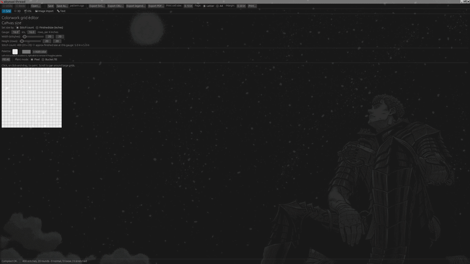
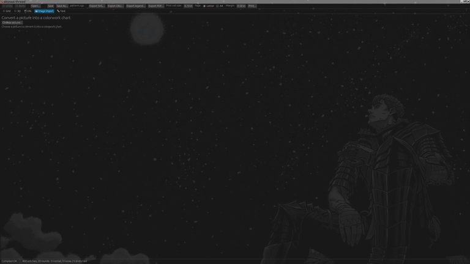
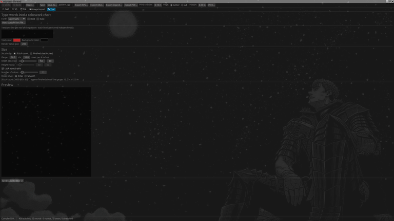

# Abyssal Thread

A crochet CAD tool, written in Rust to help out my wife: describe a pattern in a small text
language (or paint/import one visually), and get a 3D model, a tension
check, a real crochet chart, and a print-ready PDF out the other end -
all from the same pattern.

[](https://github.com/AbyssalOath/abyssal-thread/actions/workflows/ci.yml)

## What it does

- **Two ways to build a pattern:** a compact text DSL for shaped/tapered
  pieces (amigurumi, hats, motifs - `8sc`, `(3sc, inc) * 4`, custom
  stitches), or a point-and-click paint grid for flat colorwork
  (graphgan/tapestry-crochet charts) - hand-painted, imported from a
  photo, or generated from typed text.
- **3D preview** of the actual stitch structure, laid out automatically
  from the pattern (with an optional physics-relaxation pass for
  asymmetric shapes), so you can see what you're making before you make it.
- **Tension checking** - flags stitches that are unusually tight or loose
  relative to your gauge, right in the 3D view and the grid editor.
- **Real crochet charts** - standard US stitch symbols, not placeholders,
  exported as SVG.
- **Print-ready PDFs** for both shaped and colorwork patterns, tiled
  across pages with reference numbers and a color/tension legend, ready
  to tape together.
- **Crash-safe editing** - your work is autosaved continuously and offered
  back to you if the app ever closes unexpectedly.

## Demonstrations







## Install & run

### Download a prebuilt release (recommended)

Grab the installer for your OS from the
[latest release](../../releases/latest) page (built automatically by
`.github/workflows/release.yml` for every tagged version). Each release
uploads these files - version numbers below match the current release
(`0.2.8`) as an example, but the same naming pattern applies to every
release:

- **Windows** - `Abyssal-Thread_0.2.8_x64-setup.exe` (or the `.msi` if you
  prefer an MSI install). Run it and click through the install wizard.
- **macOS** - `Abyssal-Thread_0.2.8_aarch64.dmg` for Apple Silicon
  (M-series), or `Abyssal-Thread_0.2.8_x64.dmg` for an Intel Mac. Open the
  `.dmg` and drag Abyssal Thread into Applications.
- **Linux** - either `Abyssal-Thread_0.2.8_amd64.AppImage` (no
  installation: `chmod +x` it and run it directly; needs `libfuse2` on
  distros that don't ship FUSE 2 by default) or
  `Abyssal-Thread_0.2.8_amd64.deb` (Debian/Ubuntu: `sudo apt install
  ./Abyssal-Thread_0.2.8_amd64.deb`, or open it with your distro's package
  installer).

**These installers aren't code-signed**, so your OS will warn you the
first time you run one - this is expected, not a sign anything's wrong:

- **Windows**: SmartScreen will say "Windows protected your PC." Click
  "More info," then "Run anyway."
- **macOS**: Gatekeeper will refuse to open it from a normal double-click.
  Right-click (or Control-click) the app and choose "Open" instead, then
  confirm in the dialog that appears - only needed the first time.
- **Linux**: no OS-level warning; just make sure the AppImage/deb is
  executable/installed as described above.

Once installed, the app checks for new releases on startup and offers to
open the release page or download-and-run the new installer directly -
see "Check for Updates" in the toolbar to check manually at any time.

### Build from source

Requires a recent [Rust toolchain](https://rustup.rs/).

On Linux, you'll also need a few system libraries before `cargo build`
will succeed: 
`sudo apt install libfontconfig1-dev libfreetype6-dev` (Debian/Ubuntu; adjust for your distro).
Windows and macOS need nothing extra - their font handling uses OS-native APIs.

```bash
git clone https://github.com/AbyssalOath/abyssal-thread.git
cd abyssal-thread
cargo run -p abyssal-thread
```

That opens the GUI directly into a blank paintable canvas. Or, from the
command line:

```bash
cargo run -p abyssal-thread -- build examples/sphere.cgp --svg sphere.svg --obj sphere.obj --tension
```

which compiles a pattern, writes a chart (SVG) and a 3D armature (OBJ,
importable into Blender), and prints a tension report.

## Learn more

- [ARCHITECTURE.md](ARCHITECTURE.md) - workspace layout, full DSL grammar
  reference, what's implemented vs. still stubbed, and testing notes.
- [CHANGELOG.md](CHANGELOG.md) - what changed between releases.

## Status

Pre-1.0, actively developed. The core pipeline (DSL/paint grid -> 3D model
-> chart/print export) works end-to-end for both shaped and colorwork
patterns; see ARCHITECTURE.md's "What's real vs. stubbed" section for the
honest current gaps.

## License

See the [LICENSE](LICENSE) file for license information.

## Contributing

Issues and PRs welcome. `cargo test --workspace` should pass and
`cargo fmt --all -- --check` / `cargo clippy --workspace --all-targets --
-D warnings` should be clean before opening a PR - CI enforces all three.

## Support the Project

If you find Abyssal Thread helpful, please consider supporting its development:

[Donate via Ko-fi](https://ko-fi.com/abyssaloath)
